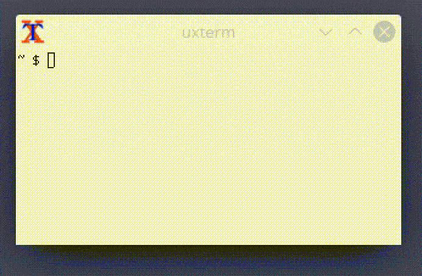

## About
This is a toy compiler for a subset of the C programming language. Made just for fun. Not intended for any production use.

The goal of this project is to write a compiler which fits in a single file and can compile itself while still resembling all the basic features of the language, so that it can as well be compiled by any mainstream toolset, like GCC or Clang.

I want to provide only a brief description of this implementation here. In general, rely on the Standard C for syntax and whatnot. This document contains information on the specifics of the compiler.

_Note: parts of this readme may become obsolete at some point and other parts may display some functionality which is not yet implemented but is very desirable._
## Program interface
### Order of execution
The compiler is a small command line utility.

Source code is fed to it via the standard input. The resulting assembly listing is dumped to standard out. Both I/O are in plain ASCII text. No fancy unicode stuff.
### What kind of input
Everything regarding the C subset is described in the paragraphs below. Refer to the "Language subset" section.
### What kind of output
The compiler produces a listing for GNU Assembler (x86_64, v2.34 at the moment of writing this doc) in AT&T syntax.
### Usage
The assembly listing can be directly fed to the assembler and from there the object can be linked to produce a binary ELF file. The program may just work on any UNIX-based system, because it does not rely on any standard library, but it was only tested on Linux.

FemtoC comes with a few sample programs. I will demonstrate how it works in practice. 

_Note: Samples use read/write syscalls of the Linux kernel, so they might not work on other systems and/or kernel APIs._

Dependencies: make, gcc, binutils (as, ld).

First, we have to build the compiler itself (the first time).
```
$ make
```
Then, compile one of the provided examples. We pass the source code through a pipe. And then the output is fed through another pipe to assembler.
```
$ cat examples/hello.c | ./cc | as
```
The object file by the name ``a.out`` was created. Let's link the object file into the final executable and run it.
```
$ ld a.out -o hello
$ ./hello
Hello, World!
```
As you can see, this compiler is very basic in terms of its user interface. Yet again, providing convenient controls is not the goal of this pet project.
### Demo

## Language subset
### Preprocessing
I know, this must not be done during compilation stage, but to cut down the costs of having to run a separate preprocessor program just to ignore a few statements during self-compilation, I decided to add some support.

The parser reads a couple of hashed statements:
- ``#include`` does not work, ignored; a dummy was put in place so that the program does not freak out when this statement is met in its own source;
- ``#define`` partially works; it can only accept single constant integers as a means of substitution.

Any extra macro statements are not supported. Please use some other tool for advanced preprocessing.

You can also insert comments like `/* ... */`. The parser will skip those. Single line comments are not supported for simplicity's sake.
### Keywords
```
int, char, sizeof, if, else, while, for, asm, return, goto, break, continue, NULL
```
These *can* be placed as identifiers, but it would be kinda tricky to use whatever variable or function you name with them.
### Data types
Four data types are supported: `int`, `int[]`, `char` and `char[]`.

**Integers** behave like unsigned 64 bit numbers. It is up to the developer to treat them as signed (by taking care of the highest bit) or unsigned, but integers work as unsigned when used alongside pointers.

**Characters** are stored as unsigned 8 bit numbers. When converted to 64 bit, bits 63:8 become 0. When a 64 bit number is converted into character, upper bits get trimmed.

**Arrays** do not preserve information about their total size, so performing ``sizeof()`` on an array returns its single element size. Arrays are only one-dimensional. To use more than one dimension one must utilize pointers. Although arrays are present as a type, they can only be used for static globals.

Both numbers and characters can have pointers, with a maximum dimensional depth of 3. So, for example, a ``char***`` is still valid, while ``char****`` is not.

_**Pointers**_ are not considered to be a distinct type internally, even though their type of origin and depth might get checked at the time of assignment. Pointer depth is preserved when an array of pointers is created.
### Variables
You can create global and local variables. Global scope is visible everywhere, while local scope is only seen in the function of declaration.

Every variable must be initialized upon declaration. You can't initialize an array. Only one variable definition is allowed in a single statement.

You can define a variable anywhere inside of a function, but it must be done prior to the usage. Defining a variable inside of a loop is equivalent to defining it at the beginning of a function, except that the variable will be reinitialized every time the statement is encountered during the execution.

A couple of words about arrays.

*Global arrays* have the type of array. They are preallocated as static space in the program's body. When used in an expression, they are treated as address numbers (i.e. integers). So if you want to change their contents, please use pointers. You can cast the arrays as pointers and dereference at will, but you won't be able to change their location.

*Local arrays* have the marking of a *pointer*. Indeed, you can change their address. But please, don't do it. Total size allocation is limited to stack memory, so use them with care. Stack storage is capped at 65Kb, so it is advisable to either use static space or preallocate memory in other way. [More about that later.] Besides, as local arrays increment the pointer depth, underlying type can be one dimension less than that of global arrays.

Declaring *global* array like ``char*** arr[N]`` is okay, while creating such a *local* array is illegal.
### Functions
Functions do not typecheck their arguments. There are no function signatures, the compiler only cares about names. Return types matter when the result is used further on in an expression. 

When the function has two arguments, they are evaluated an ascending order, but when there are three or more arguments, they are evaluated in a descending order.

You can not create a pointer to a function.

Here, I became a little bit lazy describing how it works, but all in all, functions work just as you would've expected them to work. Main differences are internal and relate to how stack frames are organized, but it should not generally affect the way you use functions in a program.
### Expressions and operators
| Kind of op | Supported |
| -- | -- |
| Binary arithmetic | `+`, `-`, `*`, `/`, `%` |
| Unary arithmetic | `-` |
| Binary logical | `&&`, <code>&#124;&#124;</code>, `>`, `<`, `==`, `!=`, `>=`, `<=` |
| Unary logical | `!` |
| Bitwise logical | `&`, <code>&#124;</code> |
| Unary bitwise logical | `~` |
### Pointer arithmetic
There is a special kind of calculation when dealing with pointers. When a variable to the left of a binary arithmetic operator has a non-zero pointer marking, value to the right (automatically converted to int) gets multiplied by the size of underlying pointed type. It is only triggered for ``+`` and ``-`` operators. Any other operation on a pointer treats it as normal integer variable and does not account for pointed type size!
### External linkage (stdlib and custom libraries)
This was not inteded by design, but can still be somehow accomplished. Forward declarations work. Epilogue is only generated when ``main`` function was defined, so it is possible to produce plain objects without the entry point.

Compile two or more source files separately and use ``ld`` utility to link objects together.

_Note: nothing is static, so you'll need to make sure that there are no name conflicts between files._

Now, the stack frame organization is not standard. In order to call methods from objects or libraries compiled with conventional tools, you will have to use ``asm`` injection and convert the frame. Such functionality was not tested yet, but it should work in theory.

***It will be very useful for calling, say, standard implementations of ``malloc`` and ``free`` to dynamically acquire memory on demand. I shall add an example and update this manual.***
## Stack model
This compiler uses non-standard stack frame. By default, 65Kb chunk of static memory is allocated for stack.

So I think it is important to show how it looks like:
| Offset | Data |
| -- | -- |
| 8+8*n(%rbp) | Argument(n) |
| ... | ... |
| 8(%rbp) | Argument(0) |
| **0(%rbp)** | **Caller base** |
| -8(%rbp) | Return address |
| -16(%rbp) | Array allocation save |
| -24(%rbp) | Local(0) |
| ... | ... |
| -24-8*n(%rbp) | Local(n) |

%rbp - base register.

Frames start at top-most chunk's location and run top-to-bottom.

In the mean time, arrays on stack are allocated in a bottom-to-top approach. So they do share common chunk with call frames, but are still held separately. This was done to simplify the calculations for local variables. "Array allocation save" is responsible for storing the allocator offset state upon the function call.
